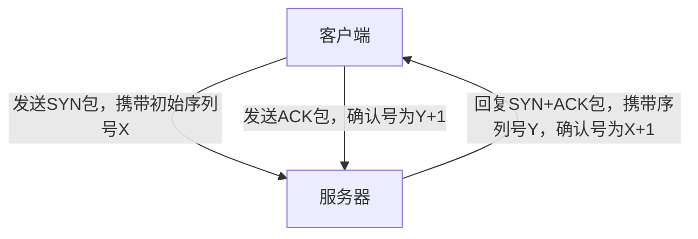
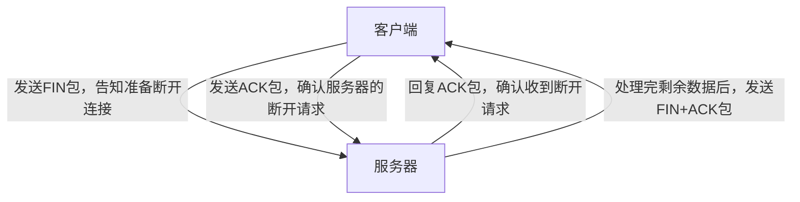

身体到达极限的时候，意志力冲出重围
# 三次握手和四次挥手

### 三次握手和四次挥手&#xA;

在计算机网络中，TCP（传输控制协议）的三次握手和四次挥手是建立和断开连接的重要机制，保障数据可靠传输。

#### 一、三次握手：建立可靠连接&#xA;

三次握手是客户端和服务器之间建立 TCP 连接的过程，确保双方都能正常收发数据，以打电话为例进行类比说明。

 

1.  **第一次握手**：客户端向服务器发送一个带有 **SYN（同步序列号）** 的数据包，好比客户端对服务器说 “我想和你建立连接，这是我的初始序列号 X”，此时客户端状态变为 **SYN\_SENT（发送同步包）** 。

2.  **第二次握手**：服务器收到请求后，返回一个带有 **SYN+ACK** 的数据包。其中 **SYN** 告知客户端 “我收到你的请求了，这是我的初始序列号 Y” ； **ACK** 确认客户端的序列号（ACK=X+1），即表示 “我知道你要连接了”，这时服务器状态变为 **SYN\_RCVD（接收同步包）** 。

3.  **第三次握手**：客户端收到服务器的回复后，再发送一个 **ACK** 数据包，确认服务器的序列号（ACK=Y+1），意思是 “我知道你准备好啦，我们开始通信吧！”，此时客户端和服务器状态都变为 **ESTABLISHED（已建立连接）** ，可以开始传 输数据 。

三次握手的必要性在于防止旧连接干扰，避免因旧的延迟数据包被误认为新连接，造成服务器资源浪费；同时实现双向确认，保证双方都确认了对方的接收和发送能力。

#### 二、四次挥手：安全断开连接&#xA;

四次挥手用于在数据传输完成后，安全地断开客户端和服务器之间的 TCP 连接，类似两人打电话结束时的告别流程。

 

1.  **第一次挥手**：客户端发送一个带有 **FIN（结束标志）** 的数据包，向服务器表明 “我数据发完了，准备断开连接”，此时客户端状态变为 **FIN\_WAIT\_1（等待对方确认结束）** 。

2.  **第二次挥手**：服务器收到 FIN 后，返回一个 **ACK** 数据包（ACK = 客户端序列号 + 1），表示 “我知道你要断开了，我还在处理剩下的数据”，这时服务器状态变为 **CLOSE\_WAIT（等待关闭）** ，客户端状态变为 **FIN\_WAIT\_2（等待对方结束）** 。

3.  **第三次挥手**：服务器处理完剩余数据后，向客户端发送 **FIN+ACK** 数据包。 **FIN** 告诉客户端 “我数据也发完了，可以断开了” ； **ACK** 确认客户端的 FIN（ACK = 客户端序列号 + 1），此时服务器状态变为 **LAST\_ACK（等待最后确认）** 。

4.  **第四次挥手**：客户端收到服务器的 FIN 后，返回一个 **ACK** 数据包（ACK = 服务器序列号 + 1），表示 “知道了，再见！”，此时客户端状态变为 **TIME\_WAIT（超时等待）** ，一段时间后自动变为 **CLOSED（关闭）** ；服务器收到 ACK 后，直接变为 **CLOSED** 。

需要四次挥手，是因为服务器可能还有未发完的数据，需要先确认客户端的 FIN（第二次挥手），等自己数据发完再发送 FIN（第三次挥手）。

#### 三、常见问题解答&#xA;

1.  **TIME\_WAIT 状态有什么作用？**

    TIME\_WAIT 状态用于防止最后一个 ACK 丢失导致服务器重发 FIN，同时确保旧数据包过期，避免干扰新连接。
    第四次挥手时，客户端发送给服务端的 ACK 有可能丢失，如果服务端因为某些原因而没有收到 ACK 的话，服务端就会重发 FIN，如果客户端在 2*MSL 的时间内收到了 FIN，就会重新发送 ACK 并再次等待 2MSL，防止 Server 没有收到 ACK 而不断重发 FIN。

2.  **握手和挥手过程中，序列号和确认号有什么用？**

    序列号（Seq）和确认号（Ack）是实现可靠双向通信确认的关键，通过它们可以保证数据按序传输，且接收方能够确认收到的数据是否完整、正确 。

3. 为什么要三次握手，两次不行吗？

    三次握手是为了确保双方都具备发送和接收数据的能力。两次握手无法确认对方的接收能力，可能导致数据丢失。
    第一次握手，server确定客户端发送正常，自己接受正常
    第二次握手，客户端确认自己发送，接收正常，对方发送接受正常，server 确认自己接受正常，对方发送正常
    第三次握手，客户端确认自己发送，接收正常，对方发送接受正常，server 确认自己发送，接收正常
4. 第二次握手服务器回传了ack，为什么还要传syn？

//
